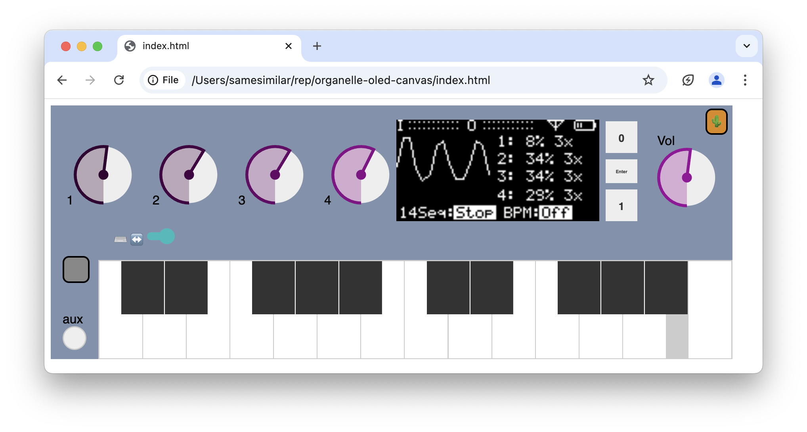

# A Browser-Based OLED emulator for Organelle
This project contains a system of components for running [Organelle](https://www.critterandguitari.com/organelle) patches on a standard desktop/laptop operating system (I've tested it on macOS). 

### This project has 3 necessary components:

* A slightly modified version of `mother.pd` that provides the runtime environment needed by Organelle patches in PureData.
* A browser-based simulator (`index.html`) of the Organelle's OLED panel and hardware controls.
* A python script (`oscweb.py`) to pass OSC messages from PureData to a web browser by broadcasting them over a web socket.

## Installing

The `oscweb.py` script has two required dependencies that need to be installed: 
* websockets 14.1
* python-osc 1.8

These can be installed in a 'virtual environment' so they are kept locally with this project.

To Install (tested on macOS):

1. First - you need to have Python 3 and pip installed on your system. See [python.org](https://python.org) for details.	
	* You can try running `python3` in a Terminal window to see if it is installed.

Run the following commands:

2. Open a terminal and change to the project directory: `cd /path/to/organelle-oled/project` 
3. Create virtual environment: `python3 -m venv .venv`
	* This creates a `.venv` folder inside the current (project) folder to hold the dependencies that will be installed in step 5.
4. Activate virtual environment: `source .venv/bin/activate`
5. Install the required dependencies (websockets and python-osc): `python3 -m pip install -r requirements.txt`

## Starting up

To use an Organelle patch, start the components of this system one-by-one in the following order:

1. With the virtual environment activated in the Terminal (Step 4, above), run `python3 oscweb.py`
2. Open `index.html` in Safari or Chrome. (e.g. Double-click this project's `index.html` file in the Finder on macOS.)
	* The "wifi" icon will be displayed on the virtual OLED screen if it is able to connect to `oscweb.py`, and `oscweb.py` will print a message to the terminal when it accepts a connection.
3. Open `mother.pd` in Pd.
4. Open the Organelle patch you wish to edit or test in Pd.

If your browser is not connected to the web socket, make sure `oscweb.py` is running, and reload `index.html`.

## Keyboard Shortcuts

* Left-shift: Aux key
* Enter: Presses main encoder button
* Up Arrow: Encoder counter-clockwise 
* Down Arrow: Encoder clockwise
* Keys asdf...: Piano keyboard keys
* Q: Toggle piano keyboard octave for shortcut keys (lower octave vs. higher octave)

Tip: Sometimes you have to twiddle the knobs (1-4) to get the Organelle patch to print to the screen.

Tip: Don't forget to turn up the volume!